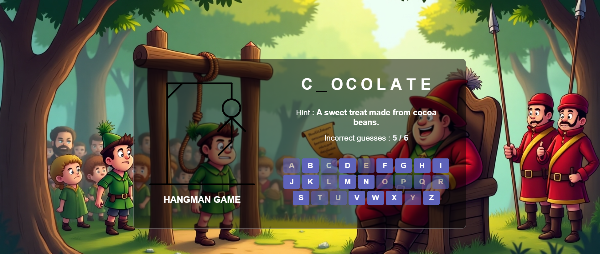

# 🏹 Hangman's Riddle: Tales of Sherwood

Welcome to Hangman's Riddle: Tales of Sherwood – a Robin Hood–inspired word puzzle game where your wits may be the only thing standing between life and the gallows! 🏹

Once upon a time in the depths of Sherwood Forest, the infamous Sheriff of Nottingham captured the loyal men of Robin Hood. Determined to crush the spirit of the outlaw hero, the evil sheriff declared a cruel game:

> “Each of your lives hangs by a thread,” he sneered. “But I am merciful... Solve my riddles, and I shall grant you freedom. Fail — and the gallows shall have its turn.”

One by one, the brave outlaws stood before the noose, their minds racing to solve the Sheriff’s wicked word puzzles.

Now, it's your turn to step into the boots of one of Robin's men. Can you outwit the Sheriff's riddles and escape the hangman’s rope?

## Solve the word. Save a life. Fail, and the forest grows silent.

  

  👉 [Click here to play the game](https://rashadul-islam-code.github.io/Hangman-s-Riddle-Tales-of-Sherwood/)

  👉 [Live Game Link](https://rashadul-islam-code.github.io/Hangman-s-Riddle-Tales-of-Sherwood/)

## 🎮 Features:

- Classic Hangman-style gameplay with a medieval twist.
- Each round is a life-or-death riddle challenge.
- Lose too many guesses, and the rope tightens...

## 🛠️ Built With

- HTML, CSS, JavaScript
- Imagination and the spirit of Sherwood

## 🧠 Inspired By

The legends of Robin Hood, the cruelty of the Sheriff of Nottingham, and the classic game of Hangman.

## 📬 Contact

Feel free to reach out or contribute!

---

🎯 Solve the word. Save a life. Fail, and the forest grows silent...

